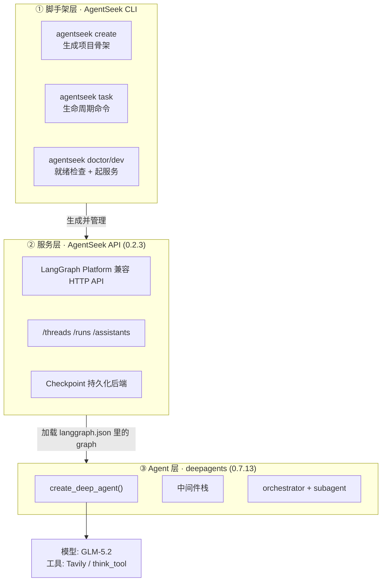
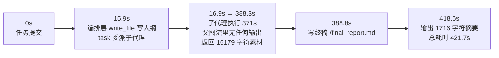

# 学习笔记：AgentSeek / DeepAgents 环境搭建与真实踩坑记录

> 课程：Datawhale《DeepAgents in Action》pre01（创建项目）+ pre02（装技能）
> 环境：原生 Windows（无 WSL）、RTX 4080、Python 3.13.14
> 模型：智谱 GLM-5.2（OpenAI 兼容接口）
> 日期：2026-09-14
> 项目路径：`C:\Users\123\WorkBuddy\DeepAgents学习\research_deepagent`

---

## 一、这次到底做了什么

用 AgentSeek CLI 脚手架生成了一个**深度研究 Agent（Deep Research）**，跑通了「前端 → AgentSeek API → LangGraph → deepagents → GLM-5.2 + Tavily」的完整链路。

**最终验证结果（不是"能启动"，是真的跑完了）**：

用课程里的题目 `Research what LangGraph 1.0 added compared with 0.x. Cite sources.` 跑了一次完整研究任务：

| 指标 | 数值 |
|---|---|
| 总耗时 | **7 分 02 秒** |
| 子代理执行耗时 | 6 分 11 秒 |
| 产出报告 | 12,988 字符，**10 条引用** |
| 工具调用次数 | 3 次（父图）|
| 研究结论 | LangGraph 1.0 是**稳定性里程碑而非功能堆料**；唯一破坏性变更是丢掉 Python 3.9 |

---

## 二、先把架构搞清楚

### 2.1 三层职责划分

很多人第一次看这个模板会懵：AgentSeek、deepagents、LangGraph 到底谁管谁。实际是三层清晰的委托关系：



| 层 | 角色 | 关键点 |
|---|---|---|
| **AgentSeek** | 脚手架 + 运行时 | 它**不是** Agent 框架，只是把 deepagents 项目包装成可运行的 LangGraph 服务（后端）+ React 前端 |
| **deepagents** | Agent 编排 | 提供 `create_deep_agent`，本质是「预设好一堆中间件的 `create_agent`」 |
| **LangGraph** | 执行引擎 | 图执行、checkpoint、流式、HITL |

> **一句话记忆**：AgentSeek 管「怎么跑起来」，deepagents 管「Agent 怎么想」，LangGraph 管「怎么执行」。

### 2.2 research graph 的真实结构

`langgraph.json` 注册的 graph 只有一个：

```json
{ "graphs": { "research": "./src/research_deepagent/agent.py:graph" } }
```

编译后的父图**只有 3 个真实节点**（内省确认）：

```
PatchToolCallsMiddleware.before_agent  →  model  →  tools
```

**关键认知：子代理不是图中的节点。** 它们是 `SubAgentMiddleware` 注册的 `task` 工具，通过工具调用**内联执行**。这就解释了一个常见困惑——为什么 `stream_mode=["updates"]` 看不到子代理的搜索过程（详见第 5 节坑 7）。

### 2.3 模型实际能看到什么（内省验证）

我用拦截 `create_agent` 调用点的方式，抓到了模型绑定的**完整工具集**（11 个）：

| 来源 | 工具 |
|---|---|
| **你传的** `tools=[...]` | `tavily_search`、`think_tool` |
| **FilesystemMiddleware** | `ls`、`read_file`、`write_file`、`edit_file`、`delete`、`glob`、`grep`、`execute` |
| **SubAgentMiddleware** | `task` |

对应的中间件栈（按装配顺序）：

```
FilesystemMiddleware  →  SubAgentMiddleware  →  _DeepAgentsSummarizationMiddleware
                      →  PatchToolCallsMiddleware  →  AnthropicPromptCachingMiddleware
```

**注意**：你没写一行文件操作代码，但模型白拿了 8 个文件系统工具——这是 deepagents 的核心卖点「开箱即用的 harness」。

---

## 三、环境搭建流程（可复现）

### 3.1 版本矩阵

| 组件 | 版本 |
|---|---|
| agentseek (CLI) | 0.1.4 |
| agentseek-api | 0.2.3 |
| deepagents | 0.7.13 |
| langchain | 1.4.0 |
| langgraph | 1.2.11 |
| Python / uv | 3.13.14 / 0.12.3 |
| Node / npm | 22.22.2 / 10.9.7 |
| vite | 8.3.0 |

> `npm 10.9.7` 这个版本号请记住，坑 1、坑 2 都由它引起。

### 3.2 命令序列

```bash
uv tool install --upgrade agentseek
uv tool update-shell                      # 把 ~/.local/bin 持久化进 PATH

agentseek create deepagents/research --checkout main --no-input
cd research_deepagent

agentseek task sync                        # 后端依赖（uv sync）
agentseek task frontend                    # 前端依赖 —— 会失败，见坑 2
cd frontend && npm install                 # 手动替代

# 填 .env（见 3.3）
agentseek doctor                           # 全 ok 才继续
agentseek dev                              # 后端 2024 / 前端 5174
```

### 3.3 `.env` 关键配置

```env
# --- 模型：智谱 GLM-5.2 走 OpenAI 兼容接口 ---
AGENTSEEK_MODEL_PROVIDER=openai            # 国产模型也填 openai，别造 GLM_API_KEY
AGENTSEEK_MODEL=glm-5.2
OPENAI_API_KEY=<你的智谱 Key>
OPENAI_API_BASE=https://open.bigmodel.cn/api/paas/v4
LANGCHAIN_OPENAI_STREAM_CHUNK_TIMEOUT_S=300   # 见下方「为什么」

# --- 持久化：Windows 必须切 SQLite（见坑 3）---
SEEKDB_EMBED=false
METADATA_DB_BACKEND=sqlite
METADATA_DB_URL=sqlite+aiosqlite:///C:/Users/123/.agentseek/research_deepagent/agentseek.db

# --- 搜索 ---
TAVILY_API_KEY=tvly-dev-...
```

**`LANGCHAIN_OPENAI_STREAM_CHUNK_TIMEOUT_S=300` 为什么要加？** LangChain 的 OpenAI 客户端有个「chunk 间隔超时」，默认 120s。智谱网关在流式返回**大 tool-call 负载**时会停顿较久，超过 120s 就断流。放到 300s 稳妥。

> `.env` 已被模板 `.gitignore` 覆盖，Key 不会进 git。

---

## 四、真实踩的坑（重点）

> 以下 5 个坑全部在本机**真实复现并修复**，每个都做了对照实验排除误判。

### 坑 1：npm 10 的 arborist 在 vitest peer 依赖环上崩溃

**现象**

```
TypeError: Cannot read properties of null (reading 'edgesOut')
    at #loadPeerSet (arborist/build-ideal-tree.js:1289)
```

**排查过程**（关键是别急着下结论）

| 怀疑对象 | 验证方法 | 结论 |
|---|---|---|
| npmmirror 镜像损坏 | 对比镜像与官方源的 manifest | ❌ 两边都正常 |
| 中文路径编码问题 | 在纯 ASCII 路径 `C:\Users\123\npm-prefix-test` 做对照实验 | ❌ 同样复现 |
| npm peer 解析 bug | 加 `--legacy-peer-deps` 重试 | ✅ **216 个包一次装成功** |

**根因**：npm 10.x 的 arborist 在解析 vitest 4.x 的 peer 依赖**环**时崩溃——`@vitest/browser-playwright@5.0.0` 反向 peer 回 vitest 5.x，形成循环。这是已知 npm bug，npm 11 才修。

**修法**（不改模板原文件）：`frontend/.npmrc`

```
legacy-peer-deps=true
```

前端依赖（react、@langchain/core）都在 `package.json` 显式声明，跳过 peer 解析不影响运行。

---

### 坑 2：模板的 `npm install --prefix frontend` 在 npm 10 下静默失效

**现象**：`agentseek task frontend` 报

```
ENOENT: no such file or directory, open '...\research_deepagent\package.json'
```

**排查**：手动复现四种写法，全部失败：

| 命令 | 结果 |
|---|---|
| `npm install --prefix frontend` | ❌ 找根目录 package.json |
| `npm --prefix frontend install` | ❌ 同上 |
| `npm install --prefix ./frontend` | ❌ 同上 |
| 纯 ASCII 路径下任意写法 | ❌ 同上 |

**根因**：npm 10 对本地目录**忽略 `--prefix`**（这个参数实际只对全局安装生效），退回从 cwd 向上找 `package.json`。**模板这条 task 声明在 npm 10 下就是坏的。**

**修法**：AgentSeek 的 `TaskV2` 支持 `cwd` 字段（源码见 `agentseek/cli/lifecycle/authored.py`），改 `.agentseek/lifecycle.toml`：

```toml
[tasks.frontend]
description = "Install frontend dependencies."
command = ["npm", "install"]
cwd = "frontend"          # ← 用 cwd 而不是 --prefix
```

---

### 坑 3（最关键）：嵌入式 SeekDB 在原生 Windows 上**必然**启动失败

**现象**

```
RuntimeError: Embedded Client is not available because pylibseekdb is not available.
Please install pylibseekdb (Linux only) or use RemoteServerClient (host/port) instead.
```

在外面看到的是 `agentseek dev` 卡在 `Timed out waiting for 'http://localhost:2024' to become ready`——**后端在 lifespan 阶段就挂了**，前端却正常起来，很有迷惑性。

**根因**：模板默认 `SEEKDB_EMBED=true`，用嵌入式 SeekDB 做 checkpoint 持久化，而 `pylibseekdb` **官方只有 Linux 版**。

**课程文档的方案是「Windows 用 WSL2」——但本机 WSL 被安全策略禁用，这条路走不通。**

**修法**：读 `agentseek_api/core/database.py` 发现 `else` 分支支持纯本地方案。切到 agentseek-api 自带的 SQLite 后端（`SqliteCheckpointSaver` + `InMemorySaver` + `SqliteStore`）：

```env
SEEKDB_EMBED=false
METADATA_DB_BACKEND=sqlite
METADATA_DB_URL=sqlite+aiosqlite:///C:/Users/123/.agentseek/research_deepagent/agentseek.db
```

**两个实现细节**：
1. `METADATA_DB_URL` 的父目录要**先手工 mkdir**（非 embed 模式不会自动创建）
2. 路径用正斜杠 + 三斜杠 + 盘符

**验证**：`/health` → `{"status":"healthy"}`，checkpoint 库 28MB 正常增长。

> **这是本次最有价值的收获**：遇到平台不兼容时，不要只盯着报错给的方案（"去装 WSL"），而是去读依赖库源码找**降级分支**。

---

### 坑 4：`TAVILY_API_KEY` 是硬门槛，会拦住整个服务启动

`deepagents/research` 模板把 Tavily 标为必需项，`agentseek dev` 会**先跑 doctor，缺 key 直接拒绝启动**。

**临时验证技巧**：用占位值先确认"其它部分是否健康"

```bash
TAVILY_API_KEY=tvly-placeholder agentseek dev
```

**正式修法**：`https://app.tavily.com` 注册免费额度（1000 次/月足够跑课程），填入 `.env`。

---

### 坑 5：内联环境变量会**静默覆盖** `.env`（隐蔽性最高）

做坑 4 的占位测试时用了 `TAVILY_API_KEY=tvly-placeholder agentseek dev`。之后换成真实 Key 重启，**却一直用的是占位值，且不报任何错**。

**根因**：`python-dotenv` 的 `load_dotenv()` **默认不覆盖已存在的环境变量**（`override=False`）。shell 里传的内联变量优先级更高。

**修法**：重启时显式清掉

```bash
unset TAVILY_API_KEY && agentseek dev     # 正确：让 .env 生效
```

> **教训**：做「不改 .env 的临时启动测试」时，一定要记住你注入的变量会在后续会话里阴魂不散。

---

## 五、机制层面的两个重要发现

### 发现 6：deepagents 的 `write_file` **不写真实磁盘**

跑完研究任务后，在项目目录里找 `final_report.md`——**找不到**。

第一反应是"任务失败了"，其实**不是**。

**根因**：`deepagents/graph.py:637`

```python
backend = backend if backend is not None else StateBackend()
```

默认 backend 是 **`StateBackend`**——文件落在 **graph state 的虚拟文件系统**里，不是硬盘。

**正确取报告的方式**：

```python
# GET /threads/{tid}/state
vals = state["values"]
files = vals["files"]        # {'/research_request.md': {...}, '/final_report.md': {...}}
report = files["/final_report.md"]["content"]     # ← 正文在这里
```

已封装成 `_extract_report.py`。

**要真正落盘**，需在 `create_deep_agent` 显式传 `FilesystemBackend` 或 `CompositeBackend`。deepagents 提供了 8 种 backend：`state` / `filesystem` / `store` / `composite` / `sandbox` / `local_shell` / `langsmith` / `context_hub`——**这是把 Agent 接入真实工程环境的关键扩展点**。

---

### 发现 7：模板的 system prompt 要求调用一个**不存在的工具**

`prompts.py` 的 `RESEARCH_WORKFLOW_INSTRUCTIONS` 第一条写得很硬：

```
1. **Plan first**: Before using task() or write_file(), you MUST call write_todos
   to create a todo list that breaks the research into focused tasks
```

但我内省出的 11 个工具里，**没有 `write_todos`**：

```
delete, edit_file, execute, glob, grep, ls, read_file, task, tavily_search, think_tool, write_file
```

**验证过程**：`write_todos` 来自 `langchain.agents.middleware.todo.TodoListMiddleware`，但 deepagents 0.7.13 的基础中间件栈（`graph.py:862-891`）**只装配了 Filesystem / SubAgent / Summarization / PatchToolCalls，没有 TodoList**。

**实际后果**：端到端运行时，编排层**直接跳到 `write_file` + `task`，完全没有规划步骤**。

```
15.9s  model  → tool:write_file        # 写研究大纲
15.9s  model  → tool:task              # 直接委派，没有 todos
```

**结论**：这是**课程模板与 deepagents 版本演进的错配**（prompt 写的是老版本行为）。影响不算致命，但对「多步研究」类任务，缺少显式规划会让任务分解质量打折。

**如果要修**：在 `agent.py` 的 `create_deep_agent(...)` 里补 `middleware=[TodoListMiddleware()]`（需从 `langchain.agents.middleware` 导入），或者把 prompt 里 `write_todos` 那段删掉——**别留着一段永远执行不到的指令**。

---

## 六、GLM-5.2 接入实测数据

### 6.1 能力探测（改配置前先跑，别配完再debug）

| 链路 | 结果 |
|---|---|
| 基础对话 | ✅ 通过 |
| 流式 | ✅ 通过，**TTFT 0.72s** |
| 工具调用 | ✅ 通过，LangChain `bind_tools` 能**并行**发多个 tool call |

### 6.2 思考模式延迟（重要）

GLM-5.2 **默认开启思考**，会先生成 reasoning tokens：

| 模式 | 简单问题延迟 | reasoning tokens |
|---|---|---|
| 默认（思考开） | 2.6 – 3.4s | ~100 – 170 / 问 |
| `thinking: disabled` | **0.7 – 0.8s** | 0（output_tokens 降到 1）|

关闭方式：

```python
model.bind(extra_body={"thinking": {"type": "disabled"}})
```

**我的建议：研究类 Agent 保留思考模式。** 关掉思考虽然快 4 倍，但输出质量下降明显（output_tokens=1 就是明证）。这个 Agent 单次任务要跑几十轮调用，延迟主要花在子代理搜索上，省这点 token 生成时间不划算。

> 顺带一提：探测时遇到过单次 47s 的个例，一度以为思考模式不可用。实测 3 次后确认**那是长回答的个例**，不是普遍延迟——**别用单次测量下结论**。

### 6.3 端到端时间线



**观测要点**：在 `stream_mode=["updates"]` 下，17s → 388s 这段时间**什么输出都没有**。这不是卡死——是子代理在内联执行，父图的 updates 流看不到。**要给足超时（建议 ≥1800s）**。

---

## 七、端到端验证的可复用方法

只看 `/health` 返回 200 是不够的，要真的跑一次任务。AgentSeek API 是 LangGraph Platform 兼容接口（`auth_type=noop`，无需鉴权）。

```python
import json, urllib.request
BASE = "http://127.0.0.1:2024"
op = urllib.request.build_opener(urllib.request.ProxyHandler({}))   # ← 关键

def post(p, body):
    req = urllib.request.Request(BASE+p, data=json.dumps(body).encode(),
        headers={"Content-Type": "application/json"}, method="POST")
    return op.open(req, timeout=1800)

# 1. 取 assistant_id（graph_id = "research"）
a = json.loads(post("/assistants/search", {}).read())[0]
# 2. 建线程
tid = json.loads(post("/threads", {}).read())["thread_id"]
# 3. 流式跑
post(f"/threads/{tid}/runs/stream", {
    "assistant_id": a["assistant_id"],
    "input": {"messages": [{"role": "user", "content": "Research ... Cite sources."}]},
    "stream_mode": ["updates"],
})
# 4. 取报告（注意是虚拟文件系统）
vals = json.loads(op.open(f"{BASE}/threads/{tid}/state").read())["values"]
report = vals["files"]["/final_report.md"]["content"]
```

**三个易踩点**：

| 要点 | 说明 |
|---|---|
| `GET /assistants` → **405** | 必须用 `POST /assistants/search`，body 传 `{}` |
| **必须绕代理** | 沙箱 Bash 里直接 curl localhost 会被网络代理拦成 **502 upstream connect failed**，用 `ProxyHandler({})` |
| 超时要给足 | 默认 120s 必挂，用 1800s |

---

## 八、pre02：给编码助手装技能

```bash
npx skills add ob-labs/agentseek --skill langchain-dev-guide --skill langsmith-trace --agent '*' --yes
npx skills list
```

- 项目级落到 `.agents/skills/`（Codex / Cursor / Gemini CLI 通用目录），并 symlink 到 `.claude/skills/`
- `--agent '*'` 会自动跳过没装的助手，报 `skipped ... (project directory not found)` 属正常
- **GitHub clone 中途断过一次**（`Failure when receiving data from the peer`）。解法：先本地浅克隆，再让 CLI 从本地路径装

```bash
git clone --depth 1 https://github.com/ob-labs/agentseek.git <cache-dir>
npx skills add "<cache-dir-abs-path>" --skill langchain-dev-guide --skill langsmith-trace --agent '*' --yes
```

---

## 九、踩坑速查表

| # | 坑 | 现象关键词 | 根因 | 修法 |
|---|---|---|---|---|
| 1 | npm arborist 崩溃 | `Cannot read properties of null (reading 'edgesOut')` | npm 10.x peer 环解析 bug（vitest 4.x） | `frontend/.npmrc` 加 `legacy-peer-deps=true` |
| 2 | `--prefix` 失效 | `ENOENT ...\research_deepagent\package.json` | npm 10 忽略本地 `--prefix` | `lifecycle.toml` 改用 `cwd = "frontend"` |
| 3 | SeekDB 不兼容 | `pylibseekdb is not available (Linux only)` | 嵌入式 SeekDB 只有 Linux 版 | 切 `SEEKDB_EMBED=false` + `sqlite` |
| 4 | Tavily 硬门槛 | doctor 拦下 `agentseek dev` | 模板标为 required | 注册免费 Key；临时可用占位值 |
| 5 | 环境变量覆盖 | 换 Key 后仍用旧值，无报错 | dotenv `override=False` | `unset VAR && agentseek dev` |
| 6 | 报告找不到 | 项目目录无 `final_report.md` | `StateBackend` 是虚拟文件系统 | 从 `/threads/{tid}/state` 取 |
| 7 | `write_todos` 不存在 | prompt 强制要求但工具集里没有 | deepagents 0.7.13 未装配 `TodoListMiddleware` | 补中间件，或删 prompt 里的死指令 |

---

## 十、我的收获与待办

### 收获

1. **遇到平台不兼容，往源码里找降级分支**。坑 3 的解法（SQLite backend）不是报错提示给的，是读 `database.py` 的 `else` 分支挖出来的。报错信息只给"最省事的方案"，不一定是你环境里可行的方案。
2. **排查要有对照实验**。坑 1 我连续排除了"镜像损坏"和"中文路径"两个错误假设，才定位到 npm 版本 bug。**凭第一直觉改配置，大概率是在错误的地方打补丁。**
3. **deepagents 的 harness 抽象是关键**。中间件栈 + 可插拔 backend，意味着同一份 Agent 逻辑可以跑在内存 / 本地磁盘 / 沙箱 / 远程存储上——这对把 Agent 从 demo 推进到产线很重要。
4. **prompt 和工具集必须对齐**。发现 7 是个典型反例：一段看起来"很规范"的强制指令，实际永远执行不到。

### 待办

- [ ] **把报告真正落盘**：当前 `write_file` 只写虚拟 FS。考虑改用 `CompositeBackend(filesystem=FilesystemBackend(root_dir=...))`，让 `/final_report.md` 直接落到本地磁盘
- [ ] **补 `TodoListMiddleware`**：修复发现 7 的 prompt / 实现错配，观察规划步骤对研究质量的影响
- [ ] **压测并发**：当前 `MAX_CONCURRENT_RESEARCH_UNITS=3`，试试提到 5 对总耗时的影响
- [ ] **接 LangSmith**：`.env` 里 `LANGSMITH_TRACING` 还是 false。跑一次 trace 看子代理的调用链，验证"父图 updates 看不到子代理"这个结论
- [ ] **探索 backend 扩展**：deepagents 提供 8 种 backend，`store` / `context_hub` 这两种和"跨会话记忆"直接相关，值得单独研究

---

## 附：本次新增文件

| 文件 | 用途 |
|---|---|
| `_probe_glm.py` | GLM-5.2 能力探测（chat / 流式 / 工具调用三合一） |
| `_e2e_research.py` | 端到端跑研究任务（建线程 → 流式运行 → 取终稿） |
| `_extract_report.py` | 从线程 state 抽取虚拟文件系统里的报告并落盘 |
| `_inspect_tools.py` | 拦截 `create_agent` 抓取模型绑定工具与中间件栈 |
| `langgraph-1.0-research-report.md` | 本次研究产出（12,988 字符，10 条引用） |

**修改的模板文件**：

| 文件 | 变更 |
|---|---|
| `research_deepagent/.env` | GLM-5.2 模型配置；持久化后端切 SQLite；Tavily Key |
| `research_deepagent/frontend/.env` | 新建（API URL / 端口） |
| `research_deepagent/frontend/.npmrc` | 新建（`legacy-peer-deps=true`） |
| `research_deepagent/.agentseek/lifecycle.toml` | `[tasks.frontend]` 改用 `cwd` |
