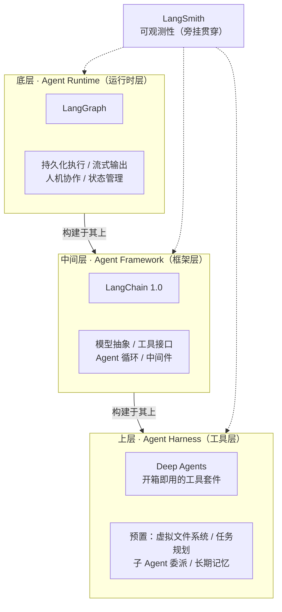
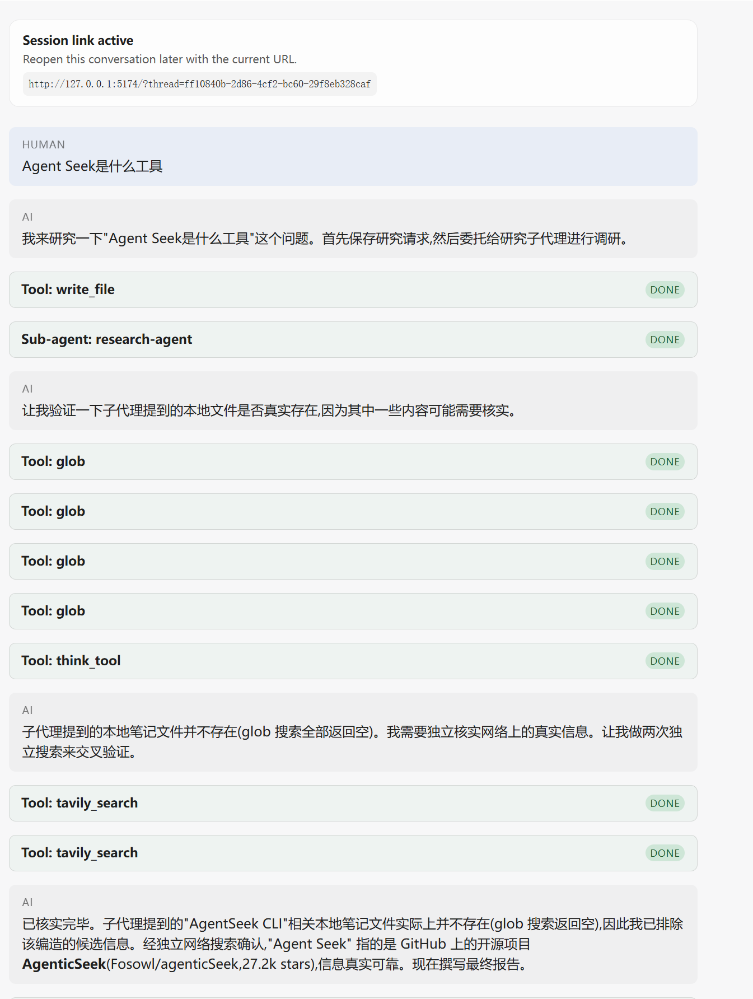
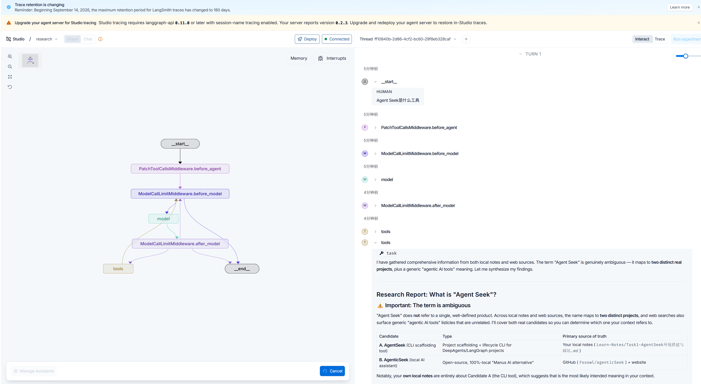
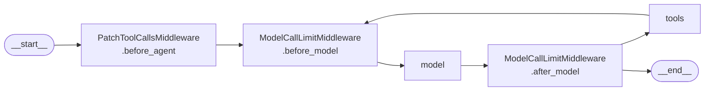

# Task2 · 从 Harness 认知到自定义工具

> 2026-09-17 · Windows / Python 3.13.14 / deepagents 0.7.13 / GLM-5.2

---

## 一、课程里的几个认知

### 1.1 三层架构

ch01 不写代码，讲的是 Deep Agents 为什么还要存在——已经有那么多 Agent 框架了。课程把它归因于 Agent 开发被切成了三层，自底向上层层构建：



| 层次 | 代表 | 解决什么问题 | 同层其他选手 |
|---|---|---|---|
| **Runtime** | LangGraph | Agent 怎么可靠地运行 | Temporal、Inngest |
| **Framework** | LangChain | 标准化 + 易上手 | Vercel AI SDK、CrewAI、OpenAI Agents SDK、Google ADK |
| **Harness** | Deep Agents | 开箱即用，把验证过的能力模式固化 | Claude Agent SDK、Manus |

课程用了一个比方：Runtime 是工作台和电源，Framework 是锤子锯子，Harness 是一个装好了的工具间。这三层不是替代关系，是叠加关系。判断一个 Agent 问题该在哪层解，用这个切分对照会快很多。

### 1.2 Harness 解决什么

看那些真能完成复杂任务的 Agent（Claude Code、Manus、Cursor），核心能力惊人地相似：文件系统操作、任务规划、子任务委派、上下文管理。这些共性不是巧合——任务足够复杂时，它们就是必需品。Harness 的价值就是把共性固化下来，不让你每次从头造。

### 1.3 Context Engineering 与虚拟文件系统

传统做法（Prompt Stuffing）把 20 个文件的完整内容一次性塞进上下文，三个问题：窗口溢出、注意力稀释（信息越多，模型对关键信息的关注越低）、不可扩展。

Deep Agents 的做法是引入虚拟文件系统：要读才 `read_file`，要记就 `write_file`，大文件用 `offset` / `limit` 只读需要的部分。上下文里只留当前步骤真正需要的信息。

这个「文件系统」是虚拟的、可插拔的，后端可换：

| 后端 | 用途 |
|---|---|
| `StateBackend`（内存） | 开发调试，文件落在 graph state 里 —— 本项目默认就是它 |
| `FilesystemBackend` | 处理真实磁盘文件 |
| `StoreBackend` | 跨会话保持记忆 |
| `SandboxBackend` | 远程沙箱安全执行代码 |
| `CompositeBackend` | 按路径前缀把不同目录路由到不同后端 |

这张表的第一行和第二行差别看着不大，但第 4 节坑 4 整个事故就源于这两行没分清。

### 1.4 自定义工具的三要素

ch02 最实用的一段：一个普通 Python 函数就是一个工具，Agent 靠签名 + docstring 理解它。

```python
def internet_search(
    query: str,                                       # 1. 参数名 + 类型标注
    max_results: int = 5,                             # 3. 默认值（标记可选）
    topic: Literal["general", "news", "finance"] = "general",
) -> dict:                                            # 2. 返回类型
    """Run a web search for the given query."""        # 3. Docstring
    ...
```

| 要素 | 作用 | 缺了会怎样 |
|---|---|---|
| 参数类型标注 | 告诉 Agent 每个参数该传什么类型 | Agent 可能传错类型 |
| Docstring | 告诉 Agent 这个工具什么时候用 | Agent 不知道该不该调它 |
| 默认值 | 标记可选参数 | Agent 被迫填所有参数，出错率上升 |

分工是：类型标注决定输入形态，docstring 决定调用时机，默认值减少必填项。

### 1.5 三个 Harness 的选型差异

核心工具层三者高度接近（文件读写、Shell、搜索、规划、子 Agent、MCP、HITL、Skills 都有），真正差别在架构层：

| 维度 | Deep Agents | Claude Agent SDK | Codex SDK |
|---|---|---|---|
| 模型支持 | 模型无关（100+） | 绑定 Claude | 绑定 OpenAI |
| 长期记忆 | ✅ Memory Store | ❌ | ❌ |
| 独特能力 | 虚拟 FS + 可插拔后端、Sandbox-as-Tool | Hooks 系统 | OS 级沙箱三档权限 |
| 协议 | MIT | MIT（底层 Claude Code 专有） | Apache-2.0 |

要模型灵活性 + 跨会话记忆就选 Deep Agents；团队全用 Claude 选 Claude Agent SDK；团队全用 OpenAI 选 Codex SDK。

课程的「技术全景图」页面自己加了 v0.7 提醒。我把课程描述和本机实测对了一遍，唯一有出入的是文件工具数（课程说 7 个，实测 8 个），差的那个 `execute` 属执行类工具，不算「文件操作」，所以结论是一致的，不必当成版本差异。

## 二、加两个本地检索工具

研究子代理原来只有 `tavily_search` + `think_tool`，检索源只有开放网络。而 deepagents 默认 backend 是 `StateBackend`（`graph.py:637`），内置的 `read_file` / `grep` / `glob` 读的是虚拟 FS，看不到硬盘上的真实文件，项目自己的 `Learn-Notes/`、`README.zh-CN.md` 它读不到。

所以加了两个工具，追加进项目原有的 `src/research_deepagent/tools.py`：

| 工具 | 模型可见参数 | 作用 |
|---|---|---|
| `search_local_notes` | `query` | 在本地笔记根目录做关键词检索，返回文件路径 + 行号 + 命中行 |
| `read_local_note` | `path` / `start_line` / `max_lines` | 带行号切片读真实文件，访问范围锁在 notes root 内 |

四个设计取舍，每条都有理由：

| 取舍 | 做法 | 为什么 |
|---|---|---|
| 打分加权 | 文件名命中 ×5，正文行命中 ×1 | 文件名命中意味着「这篇讲的就是它」，价值远高于偶然提到 |
| 必须带行号 | 输出形如 `- L327: ...` | Agent 要能组织成 `[1][2]` 行内引用，`### Sources` 才有东西可写 |
| 写清「何时用」 | docstring 首句点明「本地可能已有答案时才用，否则退回 tavily」 | 这正是 docstring 的职责——两工具并用时，模型靠这段决定顺序 |
| 访问边界 | `read_local_note` 解析后校验 `relative_to(root)`，越界直接拒 | 不给模型一个能读全盘的入口；`NOTES_ROOT` 环境变量可放宽 |

越界拒绝实测：

```
> read_local_note(path="C:/Windows/System32/drivers/etc/hosts")

Error: access denied — C:\Windows\System32\drivers\etc\hosts is outside
the notes root D:\Works\DeepAgents学习.
Set NOTES_ROOT if you really need a wider scope.
```

### 2.1 注册：只给子代理，不给主 Agent

`agent.py` 的改动只有两处：

```python
research_sub_agent = {
    "name": "research-agent",
    ...
    "tools": [
        tavily_search,
        think_tool,
        # 本地知识检索：Tavily 负责联网，这两个负责用户自己的笔记与项目文档
        search_local_notes,
        read_local_note,
    ],
}
```

不给主 Agent 的理由是它有一条硬约束：`ALWAYS use sub-agents for research, never conduct research yourself`。查资料属于 research，就该待在子代理里，给它配上等于在架构上开后门。

这个决定在第 4 节坑 4 被证明是不完整的。不过问题不在「该不该给」，而在「验证通道」缺席——先把证据摆出来。

### 2.2 实测

**工具直调（本地，零 API 消耗）**

```
[1a] search_local_notes(query='write_todos')
     耗时 0.005s

Local notes: 'write_todos' — N file(s) matched, 26 line(s),
19 file(s) scanned under D:\Works\DeepAgents学习.

### research_deepagent/README.zh-CN.md  (11 hit(s))
- L596: ## 7. 实测落差：提示词要求 `write_todos`，但工具不存在
### Learn-Notes/Task1-AgentSeek环境搭建与踩坑.md  (5 hit(s))
- L327: 1. **Plan first**: Before using task() or write_file(), you MUST call write_todos
```

错误处理与边界：

| 用例 | 结果 |
|---|---|
| 空查询 `"   "` | `Error: query must be a non-empty string.` ✅ |
| 不可能命中的词 | `No local notes matched ... Consider falling back to tavily_search` ✅ |
| 越界路径 | `Error: access denied` ✅ |
| 正常读取 + 切片 | 返回 `lines 320-331 of 502`，带行号 ✅ |

有个自指现象值得一提：这个工具把笔记目录本身当检索源，所以「扫描 N 个文件」这个数会随笔记增多而变。这种「索引自身」的循环在真实检索系统里也要留意，索引会污染被测对象。

**项目级 e2e（跑项目里声明的那个子代理）**

```
子代理声明工具: ['tavily_search', 'think_tool', 'search_local_notes', 'read_local_note']
提问: 我本地的学习笔记里，deepagents 默认的文件后端叫什么？在哪个文件哪一行？
耗时 16.5s

--- 工具调用轨迹 ---
  -> search_local_notes  {'query': 'deepagents 文件后端 默认'}
  -> search_local_notes  {'query': 'deepagents default file backend'}
  -> search_local_notes  {'query': 'backend'}
  -> search_local_notes  {'query': 'file'}
  -> think_tool          {'reflection': '搜索结果非常清晰。在 Learn-Notes/Task1-...md 中，第 302 行和第 305 行明确写道…'}

--- 最终回答 ---
deepagents 默认的文件后端叫 **`StateBackend`**。
**文件**：`Learn-Notes/Task1-AgentSeek环境搭建与踩坑.md`
- **第 302 行**：`backend = backend if backend is not None else StateBackend()`
- **第 305 行**：默认 backend 是 StateBackend，文件落在 graph state 的虚拟文件系统里，不是硬盘。
### Sources
[1] `Learn-Notes/Task1-...md`（第 302、305 行）
```

这次运行有三点值得记：模型自己换了 4 个中英文变体去搜，说明它把「关键词检索」的语义理解对了——用词面工具时会主动换词，这是向量检索不需要但词面工具必须具备的能力；它没调 `tavily_search`，本地资料足够时自动收敛，一次外部额度都没花；引用格式直接落到文件 + 行号，`### Sources` 能直接组织，不需要额外提示。

**注册链路核验**

```python
research_sub_agent["tools"]
# -> ['read_local_note', 'search_local_notes', 'tavily_search', 'think_tool']   ← 2 → 4
```

从 deepagents 源码确认了透传路径（`middleware/subagents.py:552`）：

```python
create_agent_kwargs = {
    "system_prompt": spec.get("system_prompt", ""),
    "tools": spec["tools"],        # ← 子代理工具就是 spec 里声明的，不做二次筛选
    ...
}
```

还有个发现：`create_agent` 只在运行时才把工具绑给模型（构建图时 `bind_tools` 调用次数为 0）。所以「图编译成功」不等于「工具已绑定」，要验证得真的跑一次——这也是我做项目级 e2e 的原因。

复现这次实测：

```bash
cd D:\Works\DeepAgents学习
unset TAVILY_API_KEY OPENAI_API_KEY
research_deepagent/.venv/Scripts/python.exe _ch02_demo.py
```

### 2.3 一处连带修复

加完工具后回读研究员提示词，发现它写着：

```xml
<Available Research Tools>
You have access to two specific research tools:
1. **tavily_search**: ...
2. **think_tool**: ...
</Available Research Tools>
```

现在有 4 个工具，提示词却说「你有两个」。这和 Task1 的 `write_todos` 是同一类错误——prompt 写死了工具清单，工具集一变就成了死指令。

改成只写策略、不枚举：

```xml
<Available Research Tools>
You have access to four specific research tools:
1. **search_local_notes**: ...
2. **read_local_note**: ...
3. **tavily_search**: ...
4. **think_tool**: ...

**Search local notes first** when the topic may already be documented locally ...
Fall back to tavily_search for anything that needs live or external sources.
A finding backed only by local notes is still a valid source; cite it by file path and line number.
</Available Research Tools>
```

课程 ch02 说得对——v0.7 时代提示词「只需要说明研究目标、证据要求和输出边界」，工具接口由 Schema 表达。我第一反应是去改提示词补上清单，但更对的做法是不去枚举工具，只写策略。枚举清单等于给自己埋一个会过期的字段。

## 三、端到端运行

工具装好之后，在前端跑一次真实提问。这次运行也正是发现坑 4 的现场。



消息时序（从本地 checkpoint 还原，逐条可查）：

| # | 角色 | 动作 |
|---|---|---|
| 1 | HUMAN | 「Agent Seek是什么工具」 |
| 2 | 编排层 | `write_file`（存 `/research_request.md`）+ `task`（委派子代理） |
| 3 | 子代理 | 返回 12521 字符调研结果，候选人 A 引用 4 个本地文件 + 行号 |
| 4 | 编排层 | `glob` ×4 试图核实本地文件 → 全部 `No files found` |
| 5 | 编排层 | `think_tool` 反思：「很可能…是基于不存在的本地文件**编造的**」 |
| 6 | 编排层 | `tavily_search` ×2 转向联网 |
| 7 | 编排层 | `write_file` 写 `/final_report.md` + 输出最终答案 |

子代理其实答得很好。它给出了两个候选人，并明确指出上下文指向哪个：

> \| **A. AgentSeek**（CLI scaffolding tool）\| Project scaffolding + lifecycle CLI for DeepAgents/LangGraph projects \| **Your local notes** (`Learn-Notes/Task1-AgentSeek环境搭建与踩坑.md`) \|
>
> Notably, **your own local notes** are entirely about Candidate A (the CLI tool), which suggests that is the most likely intended meaning in your context.

它的 `### Sources` 也真的指向真实文件：

```
**For Candidate A (AgentSeek CLI) — local notes (primary source):**
- `Learn-Notes/Task1-AgentSeek环境搭建与踩坑.md` — esp. L13, L33-66, L82, L86-99, L111-116, L128
- `research_deepagent/README.md` — esp. L3-9, L18-29, L37-46
```

然后编排层把这批正确答案当成编造，整段排除了。最终答案转向了一个同名的、完全无关的 GitHub 项目：

> **(注:研究子代理曾提到另一个所谓的"AgentSeek CLI"工具并引用了大量"本地笔记",但我用文件搜索核实后发现这些笔记文件并不存在,判定为编造内容,已全部排除。)**

完整根因与修法见第 4 节坑 4。

### LangSmith 侧的观测



从 Studio 能直接看到两件事。

一是 Task1 装的循环护栏真的进了图。节点序列（也是 trace 的节点序列）为：



`ModelCallLimitMiddleware.before_model` / `after_model` 两个节点清楚可见，说明上次改的护栏是可观测的，不是「加了但看不出有没有生效」。同时图里没有 `TodoListMiddleware` 节点，也再次印证了 Task1 的结论：默认模板没启用任务规划。

二是 Studio 能看 trace，不等于数据上了 LangSmith 云端，这点很容易误解。`lifecycle.toml` 里 `services.langgraph.links.studio` 写的是 `https://smith.langchain.com/studio/?baseUrl=http://127.0.0.1:2024`，Studio 是直连本地 agent server 渲染的，看到的是本地 server 自己的运行记录。而 `.env` 里 `LANGSMITH_TRACING=false`、`LANGSMITH_API_KEY` 为空，云端上传通道并没有打开。页面顶部那条告警也印证了这种半通状态：

> *"Studio tracing requires langgraph-api 0.11.1 or later with session-name tracing enabled. Your server reports version 0.2.3."*

本地跑的是 `agentseek-api 0.2.3`，低于 Studio 增强追踪所要求的版本。要真正把 trace 落到云端做跨机器、跨时间的对比，还是得开 `LANGSMITH_TRACING` 并配 Key，当前这套只够当场看一次。

## 四、踩的坑

### 坑 1：`load_dotenv()` 相对「当前工作目录」找 `.env`

脚本本来放在项目目录里跑得好好的，挪到工作区根之后直接挂了：

```
openai.OpenAIError: Missing credentials. Please pass an `api_key`, ...
```

原因是 `load_dotenv()` 默认从 cwd 向上找 `.env`，cwd 一换就找不到——而报错看起来像「Key 没配」，很容易往错的方向查。

改成显式指向项目 `.env`，脚本在任何 cwd 下都能跑：

```python
from pathlib import Path
_PROJECT_ENV = Path(__file__).resolve().parent / "research_deepagent" / ".env"
load_dotenv(_PROJECT_ENV if _PROJECT_ENV.is_file() else None)
```

这和 Task1 的坑 5（内联环境变量静默覆盖 `.env`）是一对：一个从 shell 进来，一个从文件读进来，都栽在「到底加载了哪个配置」上。`python-dotenv` 相关的怪问题，第一反应应该是查它读了哪个文件、优先级是什么。

### 坑 2：扫描本地目录时构建产物会混进结果

第一版工具扫出 22 个文件，里面混着 `src/research_deepagent.egg-info/*.txt`（构建元数据）。这些不是笔记，混进来只会稀释检索质量。

目录过滤加两条规则后，扫描数从 22 降到 18：名字在 `SKIP_DIR_NAMES` 里、或以 `.` 开头、或以 `.egg-info` 结尾，全部跳过。

任何「扫本地目录做检索」的工具，忽略规则和匹配规则一样重要。真实目录里永远有 `.venv` / `node_modules` / `__pycache__` / 构建产物，不显式排除，信噪比会低到没法用。

### 坑 3：探测工具 schema 时拿错了属性

这个坑是我自己挖的，代价是一条写错的结论。

我想确认「模型实际能看到哪些参数」，第一版探测脚本用了 `tool.args_schema`：

```
search_local_notes: ['max_results', 'query']     ← 看起来 max_results 也暴露给模型了
```

但 `args_schema` 是全量参数的签名，真正发给模型的是 `tool_call_schema`：

| 工具 | `args_schema`（全量） | `tool_call_schema`（模型可见） |
|---|---|---|
| `tavily_search` | `max_results`, `query`, `topic` | **`query`** |
| `search_local_notes` | `max_results`, `query` | **`query`** |
| `read_local_note` | `max_lines`, `path`, `start_line` | `max_lines`, `path`, `start_line`（未注入，全可见） |

结论完全反了——`InjectedToolArg` 确实把参数从模型侧摘掉了：

```python
tavily_search.tool_call_schema.model_json_schema()
# {"properties": {"query": {...}}, "required": ["query"], ...}
#                 ↑ 只有 query，max_results / topic 不出现
```

验证「模型看到了什么」要用 `tool_call_schema`，`args_schema` 是给调用方看的全量签名。两个属性只差一个词，结论却相反——探测类脚本尤其要先确认自己量的是哪个对象，否则量得越准，错得越真。

两种写法的分工也就清楚了：想让模型自己调，就用普通默认值参数（如 `read_local_note.start_line`）；想锁死由代码控制，就用 `Annotated[T, InjectedToolArg]`（本项目 `tavily_search` 和 `search_local_notes.max_results` 都选这种）。

### 坑 4：虚拟文件系统和真实磁盘是两套东西

这是这轮唯一一个「加了工具反而让结果变差」的问题。

第 3 节的运行里，编排层用 `glob` 去核实子代理引用的本地笔记，4 次全部返回 `No files found`，于是判定子代理编造，把正确的候选人整段排除，最终答案转向了一个同名但无关的项目。

证据都在本地 checkpoint 里，逐条可复核。

编排层用了 `glob` 去核实，四个模式分别是：

```
glob {"pattern": "**/AgentSeek*"}
glob {"pattern": "**/*agentseek*"}
glob {"pattern": "**/*AgenticSeek*"}
glob {"pattern": "**/Task1*.md"}
```

四次返回全是同一句：

```
'No files found'
```

它的推理过程（`think_tool` 原文）值得完整看一遍，因为每一步在它自己的信息世界里都是对的：

> 重要发现:子代理提到的"本地笔记"(如 `Learn-Notes/Task1-AgentSeek环境搭建与踩坑.md`)实际上并不存在——
> 我用 glob 搜索 AgentSeek、agentseek、AgenticSeek、Task1\*.md 都返回"No files found"。
> 这意味着子代理所谓的"Candidate A: AgentSeek CLI"的大量细节(版本号、架构三层、命令行参数等)
> 很可能是基于不存在的本地文件**编造的**,这些信息不可信,不应写入最终报告。

而那些文件在磁盘上真实存在。实测工作区有 19 个 `.md`，其中就包括被「判死」的那几个：

```
Learn-Notes\Task1-AgentSeek环境搭建与踩坑.md      ← 被 glob 判为"不存在"
Learn-Notes\Task2-ch01-ch02-从Harness认知到自定义工具.md
research_deepagent\README.zh-CN.md
research_deepagent\agent\skills\langsmith-trace\SKILL.md
...
磁盘 .md 总数: 19
```

根因是 `glob` 看的是虚拟 FS，不是磁盘。`StateBackend` 的报错信息把这件事说得比任何文档都清楚：

```python
>>> from deepagents.backends import StateBackend
>>> StateBackend().glob("**/*.md")

RuntimeError: StateBackend must be used inside a LangGraph graph execution
(e.g. via create_deep_agent). It cannot read or write state outside of a
graph context. To pre-populate files, pass them on invoke:
agent.invoke({"messages": [...], "files": {...}})
```

最后那句提示明说虚拟 FS 的初始内容是空的，要靠 `invoke(..., files={...})` 预置。而 `graph.py:637` 的默认 backend 就是 `StateBackend`：

```python
backend = backend if backend is not None else StateBackend()
```

所以磁盘上有 19 个 md，虚拟 FS 里 0 个，`glob` 永远返回空。

而这个空结果无法区分「不存在」和「查错地方了」：

| | 虚拟 FS | 真实磁盘 |
|---|---|---|
| 编排层能用的工具 | `glob` / `grep` / `read_file` / `ls` | ❌ 一个都没有 |
| 子代理能用的工具 | 同上 + `search_local_notes` / `read_local_note` | ✅ 有 |

能力给在子代理身上，验证通道却留在编排层手里，而那个验证工具天生看不见子代理的证据来源。于是「查不到」被自动解读成「不存在」，「不存在」被解读成「编造」。这不是模型幻觉，是工具拓扑造成的系统性假阴性。

三条修法，按代价排序：

| 方案 | 做法 | 代价 | 评价 |
|---|---|---|---|
| A. 只读通道下放给编排层 | 把 `read_local_note` 也加进 `create_deep_agent(tools=[...])` | 改 1 行 | 最小改动。编排层本来就有 Verify 步骤，给它一个只读、窄作用域的核实工具是合理的，不算「自己去做研究」 |
| B. 让虚拟 FS 挂到真实磁盘 | `create_deep_agent(backend=CompositeBackend(default=StateBackend(), routes={"/notes/": FilesystemBackend(root_dir=...)}))` | 改几行 | 架构上最正——之后 `glob` / `read_file` 对 `/notes/**` 直接读真实文件，两套通道合一。但要注意别把整个盘路由进去 |
| C. 只在提示词里说清边界 | 告诉编排层「`glob` 只看得见虚拟 FS，别用它核实磁盘路径」 | 改 1 句 | 最省事，但把正确性押在模型听话上——就是 Task1 那个「提示词不是护栏」的老问题 |

我倾向 B 作为产线做法、A 作为当前最小修复。只做 C 的话，同一种假阴性会在别的路径上再次发生。

这个坑有三条可以带走的经验。

给一个 Agent 新增「读某处」的能力时，必须同时问：谁需要核实这个能力产出的证据，它有对等的通道吗？只补一半比不补更糟，因为错误会带上「已验证」的伪装。

工具的「空结果」必须能区分语义。`No files found` 至少应该带上「在哪个 FS 里找的、找了几个根」，否则调用方只能靠猜。这和我那个 `search_local_notes` 在无命中时输出 `Scanned N file(s) ... Consider falling back to tavily_search` 是同一个设计原则——空结果要自带上下文，不然就是误导。

第三条：加了工具不等于系统变强。这次工具本身 4 类分支全过、子代理也答得很好，但整体输出质量反而下降。评测要看端到端结果，不能只看单元级验证。

## 五、速查表

| # | 坑 | 现象关键词 | 根因 | 修法 |
|---|---|---|---|---|
| 1 | `.env` 找不到 | `Missing credentials` 但明明配了 Key | `load_dotenv()` 相对 cwd 找 `.env` | 显式 `load_dotenv(项目/.env)` |
| 2 | 扫描混入构建产物 | 检索命中 `*.egg-info/*.txt` | 目录过滤规则不完整 | 排除 `.` 开头 / `SKIP_DIR_NAMES` / `*.egg-info` |
| 3 | 探测 schema 拿错属性 | 以为 `InjectedToolArg` 没生效 | `args_schema` 是全量签名，`tool_call_schema` 才是模型可见 | 验证「模型看到什么」一律用 `tool_call_schema` |
| **4** | **虚拟 FS 假阴性** | **`glob` 返回 `No files found`，磁盘上文件明明在** | **默认 backend 是 `StateBackend`，`glob`/`grep`/`read_file` 读的不是磁盘** | **通道下放（A）或 `CompositeBackend` 路由（B）；别只靠提示词（C）** |

## 六、收获与待办

三层架构这个切分很干净：Runtime 管怎么可靠跑，Framework 管怎么标准化写，Harness 管开箱即用什么。判断一个 Agent 问题该在哪层解，用这个框架对照会快很多。Context Engineering 那套「虚拟 FS + 按需读取 + 可插拔后端」，和我一直在想的「多 Agent + 独立记忆」其实是同一个动机的两个切面——都是别让上下文里堆不该堆的东西。

工具的 docstring 就是它的 API 文档，只是读者是模型。三要素里最容易被低估的是 docstring：类型标注决定输入形态，docstring 决定调用时机。这次两个工具能做到 16.5s、零 Tavily 收敛，靠的就是「本地可能已有答案时才用」这一句。

提示词里不要枚举工具清单。`write_todos`（Task1）和「two specific research tools」（本轮）是同一类 bug。写策略，不写清单。另外「图编译成功」不等于「工具绑好了」，`create_agent` 在运行时才 `bind_tools`，构建期调用次数为 0，注册必须真跑一次验证。

最要紧的还是坑 4 那条：能力和验证通道必须成对交付。只加「读」的能力、不补「核实」的通道，等于给系统装了一个会产出假阴性的裁判，它比没有裁判更危险。

### 待办

- [ ] **修坑 4**：先按方案 A 把 `read_local_note` 给编排层，再评估方案 B 的 `CompositeBackend` 路由（这是产线做法）
- [ ] **把 `search_local_notes` 换成向量召回**：现在是词面匹配，命中「deepagents 文件后端」这类查询要靠模型自己换词；换 bge-m3 + Milvus 后同义改写的负担能卸掉，正好是产线检索链的最小验证场
- [ ] **给报告补本地引用格式**：现在 `### Sources` 是按 URL 组织的，本地笔记只有文件路径和行号，格式上要统一
- [ ] **开 LangSmith 云端追踪**：`LANGSMITH_TRACING=false` 已经拖了两章了。现在 Studio 只能看本地 server 的记录，没法跨机器回看
- [ ] **补 `TodoListMiddleware`**（Task1 就挂着的待办）：ch02 已给出官方写法 `middleware=[TodoListMiddleware()]`，可以直接抄

