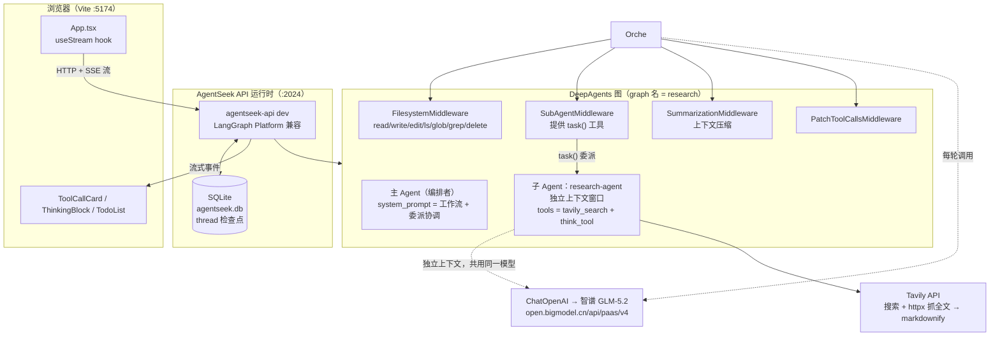
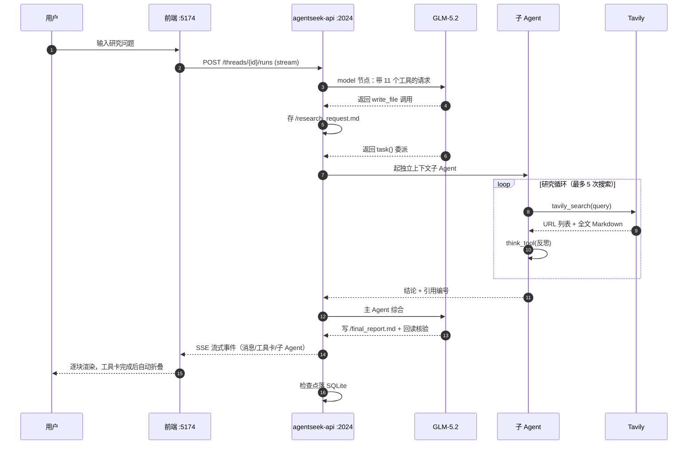

# Research DeepAgent — 深度解析

> 「主 Agent 编排 + 子 Agent 调研」的两层 DeepAgents 研究助手。
> 本文基于对项目源码、已装依赖包源码、以及本机实测命令输出的逐项核对写成，不是文档复述。
>
> 实测时间：2026-09-17 ｜ 项目根：`D:\Works\DeepAgents学习\research_deepagent`

---

## 0. 一句话定位

这是 `agentseek create deepagents/research` 拉出来的**可运行参考实现**，把上游 `langchain-ai/deepagents/examples/deep_research` 的两层编排模式，接上了国产模型（智谱 GLM-5.2）+ Tavily 检索，并配了一个 Vite 前端做流式可视化。

**它的核心价值不在"能搜网页"，而在演示了一个架构原则：编排者与执行者的上下文隔离。**

---

## 1. 版本矩阵（本机实测）

| 组件 | 版本 | 说明 |
|---|---|---|
| `agentseek` CLI | 0.1.4 | 装在 `~/.local/bin`，uv tool |
| `deepagents` | **0.7.13** | `pyproject.toml` 只声明 `>=0.5.3`，实装已到 0.7.x |
| `langchain` | 1.4.0 | |
| `langchain-core` | 1.6.3 | |
| `langgraph` | 1.2.11 | |
| `langsmith` | 0.12.4 | 随依赖自动装好 |
| `langchain-openai` | 1.6.2 | |
| `agentseek-api` | 0.2.3 | `[embedded]` extra |
| `tavily-python` | 0.8.2 | |
| Node / npm | 22.23.2 / 10.9.8 | Vite 8 要求 `>=22.12.0` |
| Vite | 8.3.0 | |
| React | 18.3.1 | 配 `@langchain/react ~0.3.5` |

> ⚠️ **注意 `deepagents` 的版本漂移**。模板提示词是按旧版 deepagents 写的，而实装是 0.7.13 —— 这直接导致了一个功能落差，见 [第 7 节](#7-实测落差提示词要求-write_todos但工具不存在)。

---

## 2. 全景架构



**三个进程边界**，各自独立：

| 层 | 端口 | 技术 | 职责 |
|---|---|---|---|
| 前端 | 5174 | Vite + React 18 | 提交问题、流式渲染、会话链接 |
| 运行时 | 2024 | `agentseek-api dev` | 跑图、管 thread、持久化检查点 |
| 模型/检索 | 外网 | 智谱 + Tavily | 推理与取资料 |

---

## 3. 逐文件解析

### 3.1 `src/research_deepagent/agent.py` —— 构图

职责单一：**把 `.env` 翻译成模型实例，再把模型和提示词组装成图。** 全文有 4 个可讲的设计：

**① 三态 provider 归一化。** 支持 `openai` / `anthropic` / `google_genai`，并把 `google`、`gemini` 归一化到 `google_genai`。本项目走 `openai`（因为智谱提供 OpenAI 兼容网关）。

**② 模型名可带 provider 前缀。** `AGENTSEEK_MODEL` 支持 `anthropic:claude-...` 这种写法，代码用 `_split_prefixed_model()` 解析，并在前缀与 `AGENTSEEK_MODEL_PROVIDER` 冲突时**主动抛错**而不是静默取一个：

```python
raise ValueError("AGENTSEEK_MODEL provider prefix does not match AGENTSEEK_MODEL_PROVIDER: ...")
```

**③ 流式 chunk 超时放宽到 300s。** 这是**为本项目量身加的保险**：

```python
# 智谱网关在流式返回大 tool-call 负载时可能停顿较久
LANGCHAIN_OPENAI_STREAM_CHUNK_TIMEOUT_S=300
```

LangChain OpenAI 默认 chunk 间隔超时是 120s。国产网关在吐一个大 tool-call JSON 时容易憋超过 120s，就会抛超时。解析失败时降级 300s 并 `warnings.warn`，`<=0` 则设为 `None`（不限）—— 容错做得完整。

**④ 委派预算通过提示词格式化注入。** 不是写死在文本里：

```python
MAX_CONCURRENT_RESEARCH_UNITS = 3     # 最多 3 路并行
MAX_RESEARCHER_ITERATIONS = 3         # 最多 3 轮委派

INSTRUCTIONS = RESEARCH_WORKFLOW_INSTRUCTIONS + "\n\n" + "="*80 + "\n\n" + \
    SUBAGENT_DELEGATION_INSTRUCTIONS.format(
        max_concurrent_research_units=MAX_CONCURRENT_RESEARCH_UNITS,
        max_researcher_iterations=MAX_RESEARCHER_ITERATIONS,
    )
```

实测确认模型实例：

```
MODEL_PROVIDER          = openai
DEFAULT_MODEL           = glm-5.2
STREAM_CHUNK_TIMEOUT_S  = 300.0
model 类型              = ChatOpenAI
model.model_name        = glm-5.2
```

### 3.2 `src/research_deepagent/tools.py` —— 工具

**`tavily_search` 是两段式的**，这是它比"只调搜索 API"强的地方：

```
Tavily search API（拿 URL 列表）
   → 对每个 URL 用 httpx.get 抓全文（UA 伪装成 Chrome，15s 超时，跟随重定向）
   → markdownify 把 HTML 转成 Markdown
   → 拼成 "## 标题 / **URL:** / 正文" 的块返回
```

返回的是**全文 Markdown**，不是摘要片段 —— 所以子 Agent 能读到真实内容。抓取失败不抛异常，而是返回 `Error fetching content from {url}: ...` 字符串，让模型自己判断跳过。

**`think_tool` 是个"空转反思锚点"**：

```python
def think_tool(reflection: str) -> str:
    return f"Reflection recorded: {reflection}"
```

它不做任何计算，唯一作用是**在工具调用循环里插入一次显式的思考回合**，人为降速。提示词强制"每次搜索后必须调 think_tool"。这是 agent 工程里很典型的一个手法：用一个 no-op 工具把推理过程外化、变成可观测的轨迹。

### 3.3 `src/research_deepagent/prompts.py` —— 提示词（三段）

| 常量 | 给谁 | 核心约束 |
|---|---|---|
| `RESEARCH_WORKFLOW_INSTRUCTIONS` | 主 Agent | 6 步固定工作流 + 报告写作规范 + 引用格式 |
| `SUBAGENT_DELEGATION_INSTRUCTIONS` | 主 Agent | 委派策略（默认 1 个子 Agent，仅对比场景并行） |
| `RESEARCHER_INSTRUCTIONS` | 子 Agent | 研究步骤 + 硬性工具预算 + 输出格式 |

**两个反直觉的设计值得单独拎出来：**

**① 主 Agent 被禁止自己搜。** 原文是硬约束：

> *"ALWAYS use sub-agents for research, never conduct research yourself"*

它只被允许做三件事：拆 todo、扔 `task()`、综合成报告。**这是整套架构的根基** —— 搜索返回的海量网页正文全部留在子 Agent 的上下文窗口里，主 Agent 的上下文只承载"任务描述 + 子 Agent 的结论"，永不被正文污染。

**② 提示词在"劝退"模型的过度分解冲动。** 委派指令里大量篇幅在说"别拆"：

> *Bias towards single sub-agent: One comprehensive research task is more token-efficient than multiple narrow ones*
> *Avoid premature decomposition: Don't break "research X" into "research X overview", "research X techniques", "research X applications"*

这是一个很实用的工程经验：**多 Agent 的默认失败模式不是"不委派"，而是"过度委派"** —— token 成本翻倍、延迟变长、结论碎片化。所以提示词里专门写了反模式清单。

**③ 报告格式规范按问题类型分支。** 对比类走 5 段式（引言/A 概览/B 概览/详细对比/结论），清单类直接列（不要引言），综述类走 5 段式。引用统一 `[1][2]` 行内 + `### Sources` 收尾，且要求**跨所有子 Agent 去重编号**。

### 3.4 前端 — 流式可视化

`frontend/src/App.tsx` 用 `@langchain/react` 的 `useStream` hook 直连后端：

```tsx
const stream = useStream<StreamState>({
  apiUrl,                    // http://127.0.0.1:2024
  assistantId: "research",   // 对应 langgraph.json 里的 graph 名
  threadId,
  onThreadId: (id) => { /* 把 thread id 写进 URL query */ },
});
```

**它把消息流"翻译"成三种渲染行**（`buildRows()`）：

| 类型 | 触发条件 | 渲染组件 |
|---|---|---|
| `prose` | human 消息 / 普通 ai 文本 | Markdown（`react-markdown` + GFM） |
| `plan` | ai 文本含 ≥2 个 plan 标记词（`SESSION INTENT`/`SUMMARY`/`NEXT STEPS`/`ARTIFACTS`） | `ThinkingBlock`（折叠块） |
| `card` | ai 消息带 `tool_calls` | `ToolCallCard`，先 `pending` 后按 `tool_call_id` 匹配结果转 `done` |

**会话链接是个亮点**：`onThreadId` 把 thread id 写进 URL query，实现"可分享的会话"—— 打开链接就能回到同一条对话（因为检查点持久化在服务端）。这是 LangGraph Platform 那套 thread 模型的直接红利。

> 📌 前端还在读 `stream.values?.todos` 渲染 TodoList 面板 —— 但这个字段**在实装里不存在**，见第 7 节。

---

## 4. 一次请求的完整数据流



**实测确认的主图状态通道**（`graph.channels`）：

```
messages, files, jump_to, structured_response,
_summarization_event, _summarization_session_id
```

`files` 是虚拟文件系统（`/research_request.md`、`/final_report.md` 就在这里面）。**注意：它是图状态，不是磁盘文件** —— 项目目录里找不到这两个 md，要取报告得从 thread state 读。

---

## 5. AgentSeek 到底帮我做了哪些事

这是最容易被误解的一节。**AgentSeek 不是运行时依赖。**

实测证据 —— 全项目 `src/` 下**零** `agentseek` import：

```python
# agent.py 的 import 清单（全部来自 deepagents / langchain / dotenv）
from deepagents import create_deep_agent
from langchain.chat_models import init_chat_model
from research_deepagent.prompts import ...
from research_deepagent.tools import tavily_search, think_tool
```

`pyproject.toml` 里的 `agentseek-api[embedded]==0.2.3` 是**服务进程**（跑图的那台），不是业务代码依赖。业务逻辑纯 `deepagents + langchain`，可以脱离 AgentSeek 单独跑。

### 5.1 它做了的事

| # | 能力 | 具体做了什么 | 实测命令 / 产物 |
|---|---|---|---|
| 1 | **脚手架生成** | 按模板 `deepagents/research` 生成整套项目骨架（源码 + 前端 + 配置 + 文档） | `agentseek create deepagents/research` |
| 2 | **声明式生命周期规格** | 把"这个项目怎么跑"写成 `.agentseek/lifecycle.toml`，其余命令全部读它 | 见下表 |
| 3 | **项目自述** | 汇总模板、端口、环境变量齐备性、可用任务 | `agentseek info` |
| 4 | **环境体检** | 按规格检查工具链、必需路径、环境变量是否就位 | `agentseek doctor` / `doctor --live` |
| 5 | **一次性安装任务** | 把依赖安装变成具名任务，不用记命令 | `agentseek task sync`、`agentseek task frontend` |
| 6 | **多进程编排** | 一条命令起后端 + 前端，并轮询健康检查 | `agentseek dev` |
| 7 | **干跑预演** | 不真起进程，只打印将要做什么 | `agentseek dev --dry-run` |
| 8 | **技能注入** | 把开发期技能装进项目，供编码 Agent 读取 | `npx skills add ...` → `.agents/skills/` |

### 5.2 `lifecycle.toml` 是真正的中枢

这个文件是整件事的设计精髓 —— **把项目运行所需的全部外部约定声明化**，于是 `info`/`doctor`/`dev`/`task` 四个命令都变成对同一份声明的不同"读取方式"：

| 区块 | 声明内容 | 被哪个命令消费 |
|---|---|---|
| `[tools]` | 需要 `uv` / `node` / `npm` | `doctor` |
| `[paths]` | 需要 `pyproject.toml`、`langgraph.json`、`frontend/node_modules` | `doctor` |
| `[env.*]` | 每个环境变量的 `required` / `default` / `description` / `aliases` | `info`（列齐备性）、`doctor` |
| `[services.*]` | 逻辑服务：名字、URL、tech、主次、文档链接 | `info`、`dev`（健康检查目标） |
| `[processes.*]` | 怎么把服务真跑起来（命令 + cwd） | `dev` |
| `[checks.*]` | HTTP 健康检查：target / timeout / attempts | `dev` |
| `[tasks.*]` | 一次性任务：描述 + 命令 + cwd | `task` |

**`[env.*]` 的 `aliases` 设计很巧**：

```toml
[env.OPENAI_API_KEY]
aliases = ["ANTHROPIC_API_KEY", "GOOGLE_API_KEY", "BUB_OPENAI_API_KEY"]

[env.AGENTSEEK_MODEL]
aliases = ["DEEPAGENTS_MODEL", "BUB_MODEL"]
```

一套声明同时兼容三个 provider 的凭据变量名和两个历史模型变量名。**代价是它只校验"存在非空"，不校验"是否与所选 provider 匹配"** —— README 里也明说了这点，属于有意识的取舍。

### 5.3 实测输出（节选）

```
$ agentseek info
Project
  Root:      D:\Works\DeepAgents学习\research_deepagent
  Name:      Research DeepAgent
  Template:  deepagents/research
  Lifecycle: .agentseek\lifecycle.toml / version 2
Entrypoints
  Dev:       agentseek dev
  Langgraph: http://127.0.0.1:2024 (runtime: agentseek-api)
  Frontend:  http://127.0.0.1:5174 (runtime: vite)
Environment
  AGENTSEEK_MODEL_PROVIDER: set (.env)
  OPENAI_API_KEY:           set (.env)
  TAVILY_API_KEY:           set (.env)
  ...
Lifecycle Tasks
  sync:     Install Python dependencies with uv.
  frontend: Install frontend dependencies.
```

### 5.4 技能注入：给"编码 Agent"用的，不是给图用的

这是**很容易搞混的一点**。项目里有两套 skills 目录：

```
.agents/skills/          ← 真实文件
├── langchain-dev-guide/ (SKILL.md + 12 个 reference/*.md + 模板)
└── langsmith-trace/     (SKILL.md + reference/cli-commands.md)

.claude/skills/          ← 指向上述的符号链接
├── langchain-dev-guide -> ../.agents/skills/langchain-dev-guide
└── langsmith-trace     -> ../.agents/skills/langsmith-trace

skills-lock.json         ← 来源 + 哈希锁定
```

**这些 skill 不会进入 DeepAgents 图**。实测证据：`create_deep_agent()` 调用**没有传 `skills=` 参数**，所以 `SkillsMiddleware` 不会被加进中间件栈。它们是给 **Claude Code / WorkBuddy 这类编码助手**读的参考文档（LangChain 用法手册 + LangSmith 排障命令），用来辅助你改这个项目。

`skills-lock.json` 用哈希锁定内容，属于供应链可复现性设计。

### 5.5 它**没有**做的事（别指望）

| 没做 | 说明 |
|---|---|
| ❌ 运行时依赖 | `agent.py` 零 import，可脱离运行 |
| ❌ 记忆层 | 没有向量库、没有长期记忆。想接 Milvus + bge-m3 得自己写 |
| ❌ LangSmith 配置 | 只在 `.env.example` 里留了 key 位置，默认 `LANGSMITH_TRACING=false` |
| ❌ 业务语义 | 不知道"研究"该怎么做，只负责把它跑起来 |
| ❌ 模型/工具正确性 | `doctor` 只查环境变量非空，查不出模型名错、工具缺失这类问题 |

---

## 6. LangSmith 如何监控这个 Agent

### 6.1 原理：零代码改动，纯环境变量

`deepagents` / `langchain` / `langgraph` 的每一次 LLM 调用、工具调用、链执行，都会经过 LangChain 的 **callback 管理器**。LangSmith 注册成一个 callback handler，把这些事件按 **run tree** 结构上报。

**业务代码一行都不用改。** 开关完全由环境变量控制 —— `agent.py` 里找不到任何 langsmith 相关代码。

### 6.2 开关判定链（实测源码）

`langsmith/utils.py`：

```python
def tracing_is_enabled(ctx=None) -> Union[bool, Literal["local"]]:
    tc = ctx or get_tracing_context()
    if tc["enabled"] is not None:      # ① 代码里显式设了 tracing_context
        return tc["enabled"]
    if get_current_run_tree():          # ② 已经在某条 trace 里
        return True
    if _context._GLOBAL_TRACING_ENABLED is not None:   # ③ 全局 fallback
        return _context._GLOBAL_TRACING_ENABLED
    var_result = get_env_var("TRACING_V2", default=get_env_var("TRACING", default=""))
    return var_result == "true"         # ④ 最后看环境变量
```

而 `get_env_var` 的命名空间是 `("LANGSMITH", "LANGCHAIN")` —— 所以：

| 生效优先级 | 变量名 |
|---|---|
| 1（最高） | `LANGSMITH_TRACING_V2` |
| 2 | `LANGCHAIN_TRACING_V2` |
| 3 | `LANGSMITH_TRACING` ← **本项目用的这个** |
| 4 | `LANGCHAIN_TRACING` |

判定是**字符串严格等于 `"true"`**，所以 `false`、`0`、`no` 全都是关闭。

### 6.3 ⚠️ 当前状态：**追踪是关闭的**

实测 `.env`：

```bash
LANGSMITH_TRACING=false      # ← 关闭
LANGSMITH_API_KEY=***        # key 已填但没被使用
# LANGSMITH_PROJECT=deepagents-course   # 被注释掉
```

所以**现在跑这个 Agent，LangSmith 上不会有任何 trace**。上面那套机制是"已经就绪但未点火"的状态。`langsmith 0.12.4` 包本身已随依赖装好，缺的只是开关和 CLI。

### 6.4 这个项目的 trace 树长什么样

结合**实测的图结构**（编译后只有 4 个节点）：

```
节点： __start__  →  PatchToolCallsMiddleware.before_agent  →  model  →  tools
```

按 `deepagents/graph.py` 里中间件的实际组装顺序（`FilesystemMiddleware` → `SubAgentMiddleware` → `SummarizationMiddleware` → `PatchToolCallsMiddleware` → prompt caching），LangSmith 上的 trace 树形如：

```
research (chain, root)                       ← graph 运行
├── PatchToolCallsMiddleware.before_agent
├── model (chain)                            ← 第 1 轮 LLM
│   ├── FilesystemMiddleware.awrap_model_call
│   ├── SubAgentMiddleware.awrap_model_call
│   ├── SummarizationMiddleware.awrap_model_call
│   ├── PatchToolCallsMiddleware.awrap_model_call
│   ├── AnthropicPromptCachingMiddleware.awrap_model_call   ← 非 Anthropic 模型自动 no-op
│   └── ChatOpenAI (llm)   ★ 真正的模型调用，token 消耗在这里
├── tools (chain)                            ← 工具执行
│   ├── FilesystemMiddleware.awrap_tool_call
│   ├── write_file (tool)
│   ├── task (tool)
│   │   └── research-agent (chain)  ★ 子 Agent 是嵌套的独立子树
│   │       ├── model (chain) → ChatOpenAI (llm)
│   │       └── tools (chain)
│   │           ├── tavily_search (tool)  ★ 搜索结果原文在这里
│   │           └── think_tool (tool)
├── model (chain)                            ← 第 2 轮
└── ...
```

> 中间件层的顺序按 `graph.py` 构造顺序推定，**以实际 trace 为准**。中间件层是透明的 —— 它们只增加延迟，你真正要看的是叶子节点。

> 🔍 **一个容易对照错的地方**：上游技能文档（`langsmith-trace`）给出的示例 trace 树里含 `TodoListMiddleware.after_model` 节点。**这个项目默认没有它** —— 实测编译后的节点只有 4 个：
>
> ```
> __start__  →  PatchToolCallsMiddleware.before_agent  →  model  →  tools
> ```
>
> 只有按 [第 7.4 节](#74-修复方案三选一) 注入 `TodoListMiddleware()` 之后，才会多出 `TodoListMiddleware.after_model` 节点（实测确认）。对照 trace 时别被文档误导。

**三个针对本项目最有价值的观测点：**

| 想看什么 | 看哪个节点 |
|---|---|
| 真实 prompt / 回复 / token 数 | 最内层的 `ChatOpenAI (llm)` |
| Tavily 抓回来的正文到底是什么 | 子 Agent 下的 `tavily_search (tool)` |
| 委派有没有发生、产生了几棵子树 | `task (tool)` 下挂了几棵 `research-agent` |
| 哪一层最慢 | 各层 `duration_ms`，重点对比中间件层 vs `ChatOpenAI` |

### 6.5 用 CLI 排查的固定套路（5 步）

```bash
# 0) 一次性：装 CLI（Windows 用 install.ps1，见 6.7）
# 1) 先找 trace 落在哪个 project —— 别假设
langsmith project list

# 2) 看最近的 trace
langsmith trace list --project default --limit 5 --include-metadata

# 3) 拿到完整调用树
langsmith trace get <trace-id> --project default

# 4) 看某个 trace 下所有 run 的输入输出（调试首选）
langsmith run list --trace-ids <trace-id> --project default --include-io

# 5) 下钻单个 run
langsmith run get <run-id> --include-io
```

**针对本项目的常用筛选：**

```bash
# 只失败的那些
langsmith trace list --project default --error --last-n-minutes 60

# 慢的（>30s）—— 本项目单次研究动辄分钟级，阈值要放大
langsmith trace list --project default --min-latency 30 --limit 10

# 只看工具调用（看 tavily 抓了什么）
langsmith run list --trace-ids <id> --run-type tool --include-io

# 只看 LLM 调用（看 token 与真实 prompt）
langsmith run list --trace-ids <id> --run-type llm --include-io
```

### 6.6 面向本项目的排查场景表

| 症状 | LangSmith 上的定位手法 |
|---|---|
| 报告里引用编号乱 / 有断层 | `run list --run-type llm` 看每轮主 Agent 综合时的 prompt，检查子 Agent 返回的编号是否被正确重排 |
| Agent 没委派、自己搜了 | 看 `task (tool)` 是否出现。没出现 → 提示词的 *"never conduct research yourself"* 没镇住，考虑加强措辞 |
| 委派过头（起了 3+ 子 Agent） | 数 `task` 下的子树数量，对照提示词里 `MAX_CONCURRENT_RESEARCH_UNITS=3` |
| 搜索很快但整体很慢 | 对比 `tavily_search` 的 duration vs `ChatOpenAI` 的 duration —— 通常是模型侧慢，不是检索 |
| 上下文被撑爆 / 触发摘要 | 找 `SummarizationMiddleware` 相关的 run，看 `_summarization_event` 是否被写入 |
| 报错但前端只显示一句 | `trace list --error` 直接定位失败的 run，`run get --include-io` 看完整异常 |
| token 花在哪了 | `run list --run-type llm` 按 `total_tokens` 排序，重点看子 Agent 的每一轮 |

### 6.7 四个坑（都踩过或验证过）

**坑 1｜`LANGSMITH_TRACING` 被 `lru_cache` 缓存。**
`get_env_var` 上有 `@functools.lru_cache(maxsize=100)`。**必须在进程启动前设好环境变量** —— 服务跑起来之后再改 `os.environ` 是不生效的。改完 `.env` 要重启 `agentseek-api`。

**坑 2｜Windows 上 `install.sh` 用不了。**
实测官方 install 脚本的 `resolve_os()` 只认 `linux` 和 `darwin`：

```sh
resolve_os() {
  case "$(printf '%s' "$1" | tr '[:upper:]' '[:lower:]')" in
    linux) printf 'linux' ;;
    darwin) printf 'darwin' ;;
    *) return 1 ;;      # ← Windows 走这里，直接 die
  esac
}
```

脚本头部注释明确写了有 PowerShell 对应版本：*"scripts/install.ps1 mirrors this structure function for function"*。所以 Windows 请走 `install.ps1`（来源域名 `cli.langsmith.com`）。

另外：**`langsmith` PyPI 包本身不带 CLI**（`entry_points.txt` 里只有 `pytest11` 插件），CLI 是独立的 Go 二进制 —— 别指望 `pip install langsmith` 之后就有 `langsmith` 命令。

**坑 3｜中文网络环境要换端点。**
默认端点 `https://api.smith.langchain.com`。国内建议用 APAC：

```bash
LANGSMITH_ENDPOINT=https://apac.smith.langchain.com
```

实测 `langsmith 0.12.4` 的端点列表里确认存在 `apac.smith.langchain.com`、`eu.`、`aws.` 等。

**坑 4｜永远不要用 `--api-key` 传 key。**
CLI 会自动读 `LANGSMITH_API_KEY` 环境变量。用 `--api-key <value>` 会把密钥泄进 shell history、进程列表和 Agent 工具调用日志。key 格式为 `lsv2_pt_` 开头。

### 6.8 开启监控的完整步骤

**① 改 `.env`**（key 已填，只需打开开关并指定项目名）：

```bash
LANGSMITH_TRACING=true
LANGSMITH_API_KEY=<已有的 lsv2_pt_... key>
LANGSMITH_PROJECT=deepagents-research      # 不设则落到 "default"
# 国内建议加：
# LANGSMITH_ENDPOINT=https://apac.smith.langchain.com
```

**② 装 CLI**（Windows 走 ps1；装完把 `~/.local/bin` 加进 PATH）：

```powershell
# 或从 cli.langsmith.com 取 install.ps1
irm https://cli.langsmith.com/install.ps1 | iex
```

**③ 重启后端并验证**：

```bash
# 重启让你的 .env 生效
uvx agentseek dev

# 另开一个终端
langsmith project list      # 看到项目列表 = 认证 OK
```

**④ 跑一轮研究，然后**：

```bash
langsmith trace list --project deepagents-research --limit 3 --include-metadata
```

### 6.9 辅助监控：LangGraph Studio

`lifecycle.toml` 里已经声明好了 Studio 入口，**不需要装 LangSmith 就能用**（本地直连）：

```
http://127.0.0.1:2024/docs        ← API 文档
https://smith.langchain.com/studio/?baseUrl=http://127.0.0.1:2024
```

Studio 提供图形化的图执行视图（节点、状态、每步 IO），是 LangSmith 云端 trace 的本地补充。**区别**：Studio 看"这一次执行走到哪了"，LangSmith 看"历史上所有执行的对比与检索"。

### 6.10 一个容易混淆的点

`deepagents` 里有个 `backends/langsmith.py`，实现的是 `LangSmithSandbox` —— 那是**用 LangSmith 的云端沙箱来跑代码**（给 `execute` 工具提供执行环境），和**追踪监控是两件完全不同的事**。别被文件名骗了。

---

## 7. 实测落差：提示词要求 `write_todos`，但工具不存在

**这是本次核对最重要的发现，属于真实的功能落差，不是文档差异。**

### 7.1 现象

`prompts.py` 的工作流第 1 步是硬约束：

> 1. **Plan first**: Before using task() or write_file(), you **MUST** call write_todos to create a todo list

`README.md` 的烟测预期也写着：

> - A live **Research plan** todo panel appears when the agent writes todos.

前端也确实在读这个字段：

```tsx
const todos = Array.isArray(stream.values?.todos) ? stream.values.todos : [];
```

### 7.2 实测证据（三重确认）

**① 工具集里没有 `write_todos`** —— dump 编译后图的 ToolNode：

```
delete, edit_file, execute, glob, grep, ls, read_file,
task, tavily_search, think_tool, write_file
                                  ↑ 共 11 个，没有 write_todos
```

**② 图状态里没有 `todos` 通道**：

```
channels: ['__pregel_tasks', '__start__', '_summarization_event',
           '_summarization_session_id', 'branch:to:...',
           'files', 'jump_to', 'messages', 'structured_response']
           ↑ 没有 'todos'
```

**③ `deepagents` 0.7.13 的基础栈已不含 TodoListMiddleware。** 全包搜索 `write_todos` 只在 **harness profile** 里出现，而基础栈的组装代码（`graph.py:862-915`）只 append 这些：

```
FilesystemMiddleware → SubAgentMiddleware → SummarizationMiddleware
→ PatchToolCallsMiddleware → [profile extras] → prompt caching → MemoryMiddleware(条件)
```

`TodoListMiddleware` 只在特定 profile 里通过 `extra_middleware` 注入，例如 `_openai_codex.py:77`：

```python
middleware: list[AgentMiddleware[Any, Any, Any]] = [TodoListMiddleware()]
```

而本项目的 `create_deep_agent()` 调用**既没传 `skills=` 也没传 `middleware=`**，所以 `todo` 机制根本没进栈。

### 7.3 影响

| 影响 | 严重度 |
|---|---|
| 提示词第 1 步（强制写 todo）无法执行，模型只能忽略 | 🟡 中 |
| 前端 TodoList 面板永远空白（`values.todos` 恒为 `undefined`） | 🟡 中 |
| `README.md` 的烟测预期与实际行为不符 | 🟢 低（仅文档） |
| 研究流程本身能跑通（模型会跳过缺失的工具继续） | ✅ 不阻塞 |

### 7.4 修复方案（三选一）

**方案 A｜注入 TodoListMiddleware（改动最小，恢复原设计意图）**

```python
# agent.py
from langchain.agents.middleware import TodoListMiddleware

graph = create_deep_agent(
    model=model,
    tools=[tavily_search, think_tool],
    system_prompt=INSTRUCTIONS,
    subagents=[research_sub_agent],
    middleware=[TodoListMiddleware()],   # ← 新增
)
```

实测确认 `create_deep_agent` 的签名**确实接受 `middleware=`**（会插在基础栈之后、tail 之前），且 `TodoListMiddleware.state_schema` 就是 `PlanningState`。

**并且我实测跑了一遍对比，方案确实有效：**

```
基线（未注入）
  工具数: 11
  write_todos: ❌ 缺失
  channels 含 todos: False

注入 middleware=[TodoListMiddleware()] 之后
  工具数: 12
  write_todos: ✅ 已注入
  新增工具: ['write_todos']
  channels 含 todos: ✅
  新增 channel: 'todos'
  新增节点: TodoListMiddleware.after_model
  新增分支: branch:to:TodoListMiddleware.after_model
```

所以加上后前端的 todo 面板就能工作了。

**方案 B｜改提示词，去掉 `write_todos` 要求** —— 更保守，但失去计划外显化的能力。

**方案 C｜锁定 `deepagents` 版本** 到包含 TodoListMiddleware 的旧版 —— 不推荐，会连带丢其它 0.7.x 特性。

> 建议：如果只是学习/演示，**方案 A** 性价比最高（一行改动，恢复提示词与前端两处的预期）。

---

## 8. 循环控制：为什么它会"看起来像死了"

**一句话结论：默认配置下这个 Agent 的循环实际上没有上限。** 提示词里那些数字（搜索 ≤5 次、并行 ≤3、委派 ≤3 轮）全是自然语言建议，模型可以无视；而框架层的兜底值被上游设成了 **9999**，对 1 轮 model↔tools 只算 2 步的 agent 图来说等同无限。

### 8.1 现象

问一句「Agent Seek 的主要作用是什么」，前端可见的子代理轨迹：

| 工具 | 可见调用次数 |
|---|---|
| `tavily_search` | 5 |
| `read_local_note` | 6 |
| `read_file` | 2 |
| `search_local_notes` | 1 |
| `think_tool` | 1 |
| **合计** | **15 次**（且仍在增加） |

前端只有一个 `Sub-agent: research-agent` 的 `RUNNING…` 标签，**不显示"第几次 / 还剩多少次"**，所以 15 次调用叠上 `tavily_search` 抓网页全文的耗时（每次数秒），视觉上就是"卡死了"。它并不是死锁，是**没有预算的自由循环 + 无进度反馈**。

### 8.2 根因（三层，逐层实测）

**第一层｜提示词不是护栏。** `prompts.py` 的 `<Hard Limits>` 里写着「Complex queries: Use up to 5 search tool calls maximum」，但这是写给模型的**建议文本**。实测跑飞时它照样超（上表 5 次 web 搜索之外还有 10 次本地检索 —— 提示词的预算只覆盖了 web 搜索这一种工具，没覆盖新增的本地工具）。

**第二层｜框架兜底值被设成 9999。** 两处硬编码，都是上游刻意的：

| 位置 | 值 | 理由 |
|---|---|---|
| `langchain/agents/factory.py:1831` | `{"recursion_limit": 9_999}` | 官方注释：为兼容 middleware 链深度（引用 langgraph issue #7313） |
| `deepagents/graph.py:971` | `{"recursion_limit": 9_999}` | deepagents 再包一层 |

9999 步 ≈ **5000 轮** model↔tools 往返。这是为"middleware 节点链"预留的余量，但没有配套的循环护栏。

**第三层｜子代理的 9999 覆盖不掉。** 这是最容易踩的一点，实测得到的配置生效矩阵：

| 作用域 | 外层 `.with_config({"recursion_limit": N})` | 挂 middleware |
|---|---|---|
| 主图（编排层） | ✅ **生效**（实测读到 40） | ✅ 生效 |
| 子代理 | ❌ **无效**（仍读到 9999） | ✅ 生效 |

原因是两条叠加：子代理的 runnable 由 `create_agent` 构建，**自身就绑定了 `recursion_limit: 9999`**（实测 `sub.config` 的 metadata 是 `ls_integration: langchain_create_agent`）；而 deepagents 的 `subagents.py` 明确注释了合并规则 —— *"the subagent's bound config still wins collisions (e.g. `recursion_limit`)"*。所以**主图收紧 recursion_limit 传导不到子代理**，子代理只能靠 middleware 约束。

> 反过来说：如果你只收紧主图、以为子代理也跟着收紧了，那就是漏了最大的一处循环。

### 8.3 修法（已落地在 `agent.py`）

用 `langchain.agents.middleware` 里的两个限流中间件，**硬停**而非建议：

```python
from langchain.agents.middleware import (
    ModelCallLimitMiddleware,
    ToolCallLimitMiddleware,
)

# 子代理：单次委派的工具/模型调用预算
research_sub_agent = {
    ...
    "middleware": [
        ToolCallLimitMiddleware(run_limit=MAX_SUBAGENT_TOOL_CALLS, exit_behavior="end"),
        ModelCallLimitMiddleware(run_limit=MAX_SUBAGENT_MODEL_CALLS, exit_behavior="end"),
    ],
}

# 主图：编排层自保 + 收紧步数
graph = create_deep_agent(
    ..., 
    middleware=[ModelCallLimitMiddleware(run_limit=MAX_ORCHESTRATOR_MODEL_CALLS, exit_behavior="end")],
).with_config({"recursion_limit": MAX_ORCHESTRATOR_STEPS})
```

**为什么用 `exit_behavior="end"` 而不是 `"error"`：** 超限时它会注入一条说明消息（`Tool call limit reached: run limit exceeded (6/5 calls).`）并正常结束本轮，**已获得的结果会一并交回编排层**，主 Agent 能基于现有材料把报告写完。`"error"` 会抛异常掀掉整个 run —— 对研究类任务不合适。

### 8.4 取值算账（`agent.py` 顶部常量）

| 常量 | 值 | 依据 |
|---|---|---|
| `MAX_SUBAGENT_TOOL_CALLS` | 24 | 实测「只查本地笔记」的简单问题用掉 **10 次**；复杂问题按提示词预算（5 次 web 搜索 ×2 含 think_tool + 本地检索）正常最坏约 20~22 次 |
| `MAX_SUBAGENT_MODEL_CALLS` | 30 | 每次工具调用对应 1 次模型调用，加收尾 |
| `MAX_ORCHESTRATOR_MODEL_CALLS` | 24 | 主 Agent 一轮完整任务约 6~8 次（拆解/存请求/委派/综合/写盘/核验），留 3 轮委派余量 |
| `MAX_ORCHESTRATOR_STEPS` | 100 | 100 步 ≈ 50 轮，主 Agent 正常 12~16 步 |

> ⚠️ **16 是不够的。** 我第一版按「5 次搜索 + 5 次 think + 少量本地检索」估到 16，实测发现单个简单本地问题就用掉 10 次，16 会误伤正常任务。**别拍脑袋估，先量一次。**

调参就改这 4 个常量。想让它更快止损就调小，代价是复杂调研可能被截断。

### 8.5 实测验证（4 项，全部通过）

| 场景 | 结果 |
|---|---|
| 造一个「工具要求模型循环 8 次」的任务，不挂护栏 | 工具被调 **8 次**，跑满才停 —— 证实无护栏 |
| 同任务 + `ModelCallLimitMiddleware(run_limit=5)` | 第 **5** 次模型调用后停，注入 `Model call limits exceeded: run limit (5/5)` ✅ |
| 同任务 + `ToolCallLimitMiddleware(run_limit=4)` | 第 **4** 次工具调用后停，注入 `Tool call limit reached: run limit exceeded (5/4 calls).` ✅ |
| 真实子代理 spec + 「永远不要停止」的提示词 + `run_limit=5` | 截断在 **5 次**，且返回可读消息供编排层收尾 ✅ |
| 回归：真实子代理跑一次正常本地调研 | 10 次工具调用 / 31 秒，**未触发护栏**（不误伤）✅ |

### 8.6 还能怎么调

| 手段 | 粒度 | 说明 |
|---|---|---|
| 改 `agent.py` 的 4 个常量 | 全局默认 | 最直接，改完重启 `agentseek dev` 生效 |
| 前端 / API 每次请求传 `config.recursion_limit` | 单次请求 | agentseek-api 支持（`run_executor.py` 会透传），**只需覆盖步数，不覆盖 middleware** |
| 收紧 `prompts.py` 的 `<Hard Limits>` | 建议 | 让模型**尽量**自己收敛，减少触达硬停的次数。与 middleware 是互补关系，不是替代 |

---

## 9. 与产线 Search Agent 的对照

这个项目正好可以当作"从单 Agent + MCP 注入 → 多 Agent + 独立记忆"演进路上的**第一个对照组**：

| 维度 | 本项目 | 产线 Search Agent（演进目标） |
|---|---|---|
| 编排 | 主 Agent + 1 类子 Agent，静态 `subagents=[...]` | 多 Agent，按意图动态路由 |
| 上下文隔离 | ✅ 子 Agent 独立窗口 | ✅ |
| 工具接入 | 直接传 Python 函数（主 Agent 2 个，子 Agent 4 个） | MCP 注入（7000+ API 工具化） |
| **长期记忆** | ❌ 无，只有 thread 检查点 | 🔜 Milvus + bge-m3 |
| 观测 | LangSmith（已就绪未开） | 同上，可复用到产线 |
| 成本控制 | 原为提示词硬约束（实测约束不住）→ 已补 middleware 硬停，见[第 8 节](#8-循环控制为什么它会看起来像死了) | 需要更结构化的预算机制 |
| 持久化 | SQLite（本地） | PostgreSQL + Flyway |

**最值得借鉴的两点：**

1. **"编排者不亲自干活"这条硬约束写进提示词** —— 简单但极其有效的架构约束手段。产线的多 Agent 演进也可以用同样方式守住"路由 Agent 不直接回答"的边界。
2. **`think_tool` 这种 no-op 反思锚点** —— 用零成本工具把推理外化，既降速又留下可观测轨迹。这个手法可以直接搬。

**最明显的缺口：没有记忆层。** 本项目每轮研究都从零开始，同样的主题问两次会重复搜索、重复消耗 token。接 Milvus + bge-m3 之后，可以把子 Agent 的调研结论沉淀成可复用知识 —— 这正是产线演进方向要解决的问题。

---

## 10. 命令速查

```bash
# --- 环境准备（一次性）---
uvx agentseek task sync          # Python 依赖
uvx agentseek task frontend      # 前端依赖

# --- 体检 ---
uvx agentseek info               # 项目概览
uvx agentseek doctor             # 静态体检
uvx agentseek doctor --live      # 服务在跑时做真实端点检查
uvx agentseek dev --dry-run      # 干跑，不起进程

# --- 启动 ---
uvx agentseek dev                # 后端 :2024 + 前端 :5174

# --- 单独起某个进程 ---
cd frontend && npm.cmd run dev   # 前端（Windows 必须用 npm.cmd）
uv run agentseek-api dev --port 2024

# --- 烟测 ---
# 浏览器打开 http://127.0.0.1:5174，问：
#   Research what LangGraph 1.0 added vs 0.x. Cite sources.

# --- LangSmith（开启后）---
langsmith project list
langsmith trace list --project <name> --limit 5 --include-metadata
langsmith trace get <trace-id> --project <name>
langsmith run list --trace-ids <trace-id> --project <name> --include-io
langsmith run get <run-id> --include-io
```

---

## 11. 本机环境坑清单

| # | 坑 | 现象 | 修法 |
|---|---|---|---|
| 1 | Node 版本过低 | Vite 8.3.0 要求 `^20.19.0 \|\| >=22.12.0`，系统是 20.16.0 → 拒绝启动 | 已升到 **22.23.2**（机器级 PATH，需提权） |
| 2 | `npm` vs `npm.cmd` | `uvx agentseek task frontend` 报 `WinError 193` | `lifecycle.toml` 两处改成 `npm.cmd`（Python 3.12 的 `shutil.which` 裸名优先命中 bash 脚本） |
| 3 | 无 `pylibseekdb` | 报 `pylibseekdb is not available (Linux only)` | `.env` 切 `SEEKDB_EMBED=false` + `METADATA_DB_BACKEND=sqlite` |
| 4 | 端口 5174 被占 | `Port 5174 is already in use` | 父进程被 kill 后 vite 子进程不跟着死，需 `taskkill /F /T` |
| 5 | 报告"不见了" | 项目目录里找不到 `/final_report.md` | deepagents 的 FS 是**内存态**（图状态），要从 thread state 取 |
| 6 | PyCharm 解释器指旧目录 | venv 全干净但 IDE 仍指 `C:\Users\123\WorkBuddy\...` | 改 `%APPDATA%\JetBrains\...\options\jdk.table.xml`（需先关 IDE） |
| 7 | `write_todos` 缺失 | 见第 7 节 | 一行 `middleware=[TodoListMiddleware()]` |
| 8 | **循环无上限** | 子代理一直 `RUNNING…`，十几轮工具调用不收口 | 见第 8 节：子代理挂 `ToolCallLimit` + `ModelCallLimit`；主图 `.with_config` 收紧步数。**注意外层 `with_config` 传导不到子代理** |

---

## 附：核心事实速记

- **模型**：`ChatOpenAI` 实例，`model_name=glm-5.2`，走 `https://open.bigmodel.cn/api/paas/v4`
- **图名**：`research`（`langgraph.json` 里注册，前端靠它连）
- **节点**：`__start__` → `PatchToolCallsMiddleware.before_agent` → `model` → `tools`
- **工具（11 个）**：`task` + 8 个文件系统工具 + `tavily_search` + `think_tool`
- **中间件**：Filesystem / SubAgent / Summarization / PatchToolCalls（+ Anthropic 缓存中间件空操作）
- **子 Agent**：`research-agent`，4 个工具（`tavily_search` / `think_tool` / `search_local_notes` / `read_local_note`）
- **预算（软，提示词）**：搜索 ≤5 次/子 Agent，并行 ≤3，委派轮次 ≤3
- **护栏（硬，middleware）**：子代理工具 24 / 模型 30；主图模型 24 / 步数 100（见第 8 节）
- **持久化**：SQLite `C:/Users/123/.agentseek/research_deepagent/agentseek.db`
- **前端**：`useStream` + thread id 写入 URL → 会话可分享
- **LangSmith**：埋点就绪，`LANGSMITH_TRACING=false` 未开启
